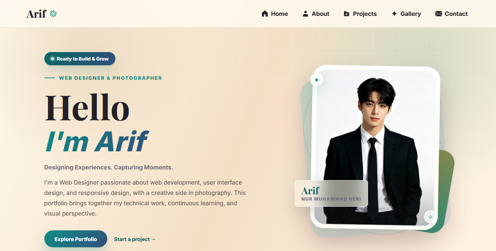

<div align="center">
  

  

  <p>
    
    
    
  </p>
</div>

## Overview

This project is a ready-to-customize portfolio website template for designers, developers, photographers, students, freelancers, or anyone who wants to present their work online. It includes a hero section, about profile, featured projects, photo gallery, favorite song player, theme switcher, and contact section.

The project does not use a frontend framework, bundler, or backend service, so it can be opened directly in the browser or deployed easily with GitHub Pages.

## Features

- Responsive portfolio template for desktop and mobile screens
- Light and dark theme switcher with saved preference
- Animated multilingual greeting in the hero section
- About section with customizable profile copy and photo collage
- Featured project cards for showcasing selected work
- Puzzle-style gallery layout with multiple image ratios
- Custom favorite song player with progress indicator
- Contact panel with customizable email, phone, and social media links
- Static-file setup, easy to host anywhere

## Tech Stack

- HTML5
- CSS
- JavaScript

## Project Structure

```text
.
|-- index.html
|-- README.md
`-- assets
    |-- css
    |   `-- styles.css
    |-- js
    |   `-- script.js
    |-- images
    |   |-- profile.jpeg
    |   |-- project-cisco_acl.png
    |   |-- project-cloud_storage.png
    |   |-- project-desain_grafis.png
    |   |-- project-mail_server.png
    |   `-- gallery
    `-- music
```

## Getting Started

Clone this repository:

```bash
git clone https://github.com/Kaguai10/Template-Portofolio
cd Template-Portofolio
```

Open the website:

```bash
start index.html
```

On macOS or Linux, you can also open `index.html` directly from your file manager or browser.

## Deploy to GitHub Pages

1. Push this project to a GitHub repository.
2. Open the repository **Settings**.
3. Go to **Pages**.
4. Set the source to the main branch and root folder.
5. Save, then wait until GitHub publishes the site URL.

## Customization

- Replace the demo name, profile text, project content, and contact links in `index.html`
- Change colors, spacing, and responsive layout in `assets/css/styles.css`
- Adjust theme behavior, greeting animation, and audio controls in `assets/js/script.js`
- Replace images inside `assets/images`
- Replace the music file inside `assets/music`

## Template Content

The current content uses sample portfolio data, images, project cards, and social links. Replace them with your own information before publishing the website.
